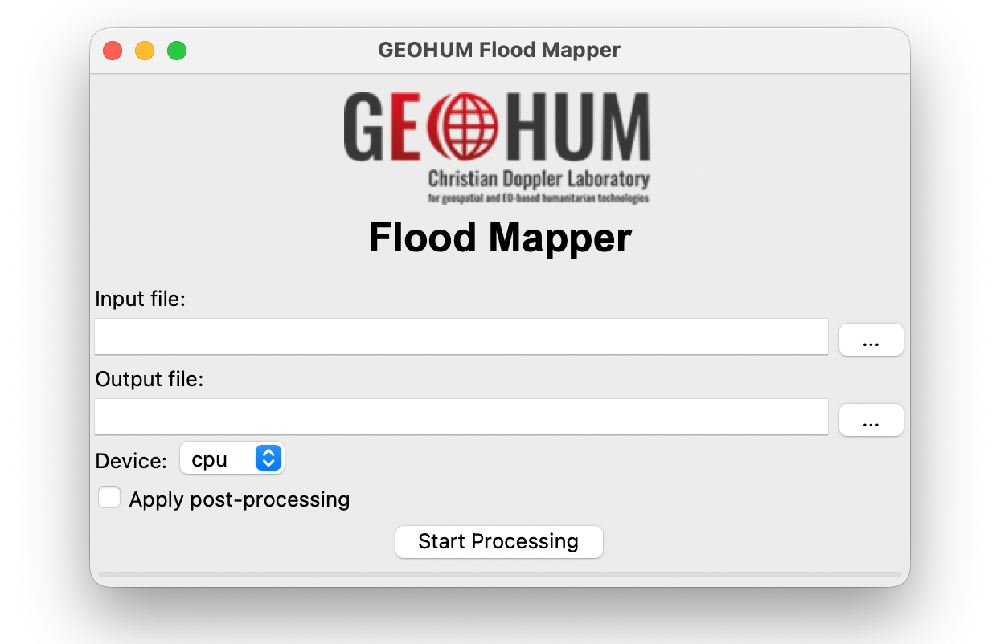

# Flood Inference Tool

- Bruno Menini Matosak

Tool created to use apply models to create water masks using Sentinel-1 images.

## SAR Image pre-processing

The images used by the tool to create flood maps are Sentinel-1 Ground Range Detected (GRD). This images must first go through some pre-processing steps using SNAP before being able to be used.

The `.zip` file can be opened directly in SNAP, and then the entire scene can be reduced to an AOI using the `Raster`>`Subset...` option. After that, there are three steps that must be followed.

 1. `Radar` > `Radiometric` > `S-1 Thermal Noise Removal`
 2. `Radar` > `Radioemtric` > `Calibrate`
 3. `Radar` > `Geometric` > `Terrain Correction` > `Range-Doppler Terrain Correction` (Remember to change 'Save as:' to 'GeoTIFF-BigTIFF')

> [!WARNING]
> The image used must contain the first the VH band, then the VV band, in this specific order. The values must also be linear value, and **NOT** in dB.

## Installation

To use this tool, first we need to save it locally either using `git clone` or downloading the files as zip and decompressing it on our machine. They can be saved anywhere.

Then we need to create a virtual environemt using [Anaconda or Miniconda](https://www.anaconda.com/download/success). I recommend using Miniconda, but if you have anaconda already installed that is more than enough. 

Then, we open any terminal that we can use the command `conda` in it, such as the Anaconda Prompt on Windows. Then we will move to the directory that you saved the contents of the repository (the folder that contains the file `inference.py`).

```
cd path/to/directory
```

We then use the following command to create an environment called ```flood_tool``` and install python and GDAL on it.

```
conda create -n flood_tool -c conda-forge python=3.12 gdal -y
```

After we created the `flood_tool` virtual environment, we need to activate it by using the following command:

```
conda activate flood_tool
```

After this, `(flood_tool)` should appear in your terminal before every input line.

At this point, we have to install the necessary requirements by using the following command:

```
pip install -r requirements.txt
```

After that, if run without any errors, the computer should be able to run the tool without any problems.

## Utilization

To use the tool, first we have to open the terminal (or Anaconda Prompt) and navigate to the folder where we saved the repository (where `inference.py` is located).

```
cd path/to/repository
```

Then, we can use the tool in UI-mode or in terminal-mode. To use it in UI-mode, suffice to run the following command:

```
python inference.py -ui
```

After that, a new window should open like the following:



To use it in terminal-mode, without a user interface, you can use other options instead of `-ui`. The following options can be used:

```
usage: inference.py [-h] [-ui] [-i INPUT_PATH] [-o OUTPUT_PATH] [-pp] [-d DEVICE]

options:
  -h, --help            show this help message and exit
  -ui, --ui-mode        Activate UI mode. Ignores all other options given.
  -i INPUT_PATH, --input_path INPUT_PATH
                        The path to the input image containing VH and VV bands (in this order).
  -o OUTPUT_PATH, --output-path OUTPUT_PATH
                        The path to the final result.
  -pp, --post-processing
                        Wheter or not to apply postprocessing and reduce noise in the results.
  -d DEVICE, --device DEVICE
                        The device used to run the inference. Example values are "cpu", "cuda", and "mps".
```

An example of utilization is:

```
python inference.py -i input/path/to/image.tif -o outut/path/to/image.tif -pp
```