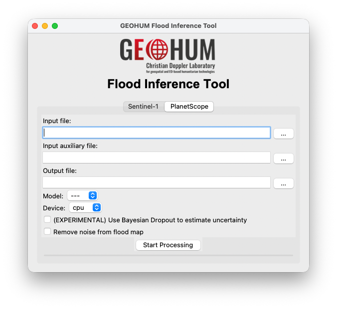

# Flood Inference Tool

Tool used to apply methods in order to create water masks using Sentinel-1 or PlanetScope imagery.

## SAR Image pre-processing

Sentinel-1 images can be used to generate flood masks, more specifically, in the Ground Range Detected (GRD) processing level. The images must first go through some pre-processing steps using SNAP before being able to be used.

The `.zip` file can be opened directly in SNAP, and then the entire scene can be reduced to an AOI using the `Raster`>`Subset...` option. After that, there are three steps that must be followed.

 1. `Radar` > `Radiometric` > `S-1 Thermal Noise Removal`
 2. `Radar` > `Radiometric` > `Calibrate`
 3. `Radar` > `Geometric` > `Terrain Correction` > `Range-Doppler Terrain Correction` (Remember to change 'Save as:' to 'GeoTIFF-BigTIFF')

 As an alternative, Sentinel-1 images obtained from Google Earth Engine can be directly used without any pre-processing.

> [!WARNING]
> The image used must contain the VH band first, then the VV band, in this specific order. The values can be either linear or in decibels ($dB$).

## Installation

To use this tool, first the repository can be saved locally either using `git clone` or downloading the files as zip and decompressing it on the local machine. They can be saved anywhere.

Then it is recomended to create a virtual environemt using [Anaconda or Miniconda](https://www.anaconda.com/download/success).

Any terminal where the command `conda` can be used, such as the Anaconda Prompt on Windows. Move to the directory where the contents of the repository are saved (the folder that contains the file `inference.py`).

```
cd path/to/directory
```

Then, use the following command to create an environment called ```flood_tool``` and install the required pacakges:

```
conda env create -f environment.yml
```

To activate the newly created environment, do:

```
conda activate flood_tool
```

After that, if no error message was shown, the computer should be able to run the tool without any problems.

## Utilization

To use the tool, first open the terminal (or Anaconda Prompt) and navigate to the folder where the repository is saved(where `inference.py` is located).

```
cd path/to/repository
```

Then, use the tool in UI-mode or in terminal-mode. To use it in UI-mode, it suffices to run the following command:

```
python inference.py -ui
```

After that, a new window should open like the following:



To use it in terminal-mode, without a user interface, you can use other options instead of `-ui`. The following options can be used:

```
usage: flood-inference-tool.py [-h] [-ui] [-i INPUT_PATH] [-i_aux INPUT_PATH_AUXILIARY] [-o OUTPUT_PATH] [-pp] [-d DEVICE] [-m MODEL] [-dB] [-bd]

options:
  -h, --help            show this help message and exit
  -ui, --ui-mode        Activate UI mode. Ignores all other options given.
  -i INPUT_PATH, --input_path INPUT_PATH
                        The path to the input image containing VH and VV bands (in this order) or PlanetScope.
  -i_aux INPUT_PATH_AUXILIARY, --input_path_auxiliary INPUT_PATH_AUXILIARY
                        The path to the auxiliary image for PlanetScope.
  -o OUTPUT_PATH, --output-path OUTPUT_PATH
                        The path to the final result.
  -pp, --post-processing
                        Wheter or not to apply postprocessing and reduce noise in the results.
  -d DEVICE, --device DEVICE
                        The device used to run the inference. Example values are "cpu", "cuda", and "mps".
  -m MODEL, --model MODEL
                        Model to use for the prediction.
  -dB                   Wether the SAR data is in dB.
  -bd, --bayesian-dropout
                        Wether to use Bayesian Dropout to estimate uncertainty.
```

An example of utilization is:

```
python inference.py -i input/path/to/S-1/image.tif -o outut/path/to/flood-mask.tif -m UNet-S1.pt -pp -d cuda
```